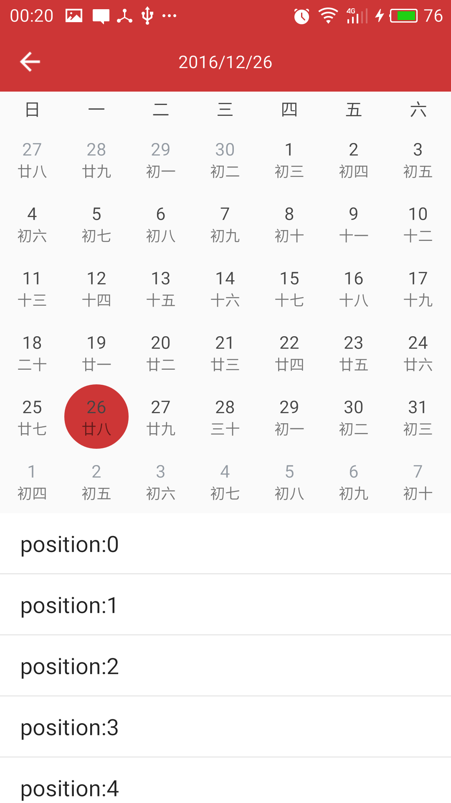
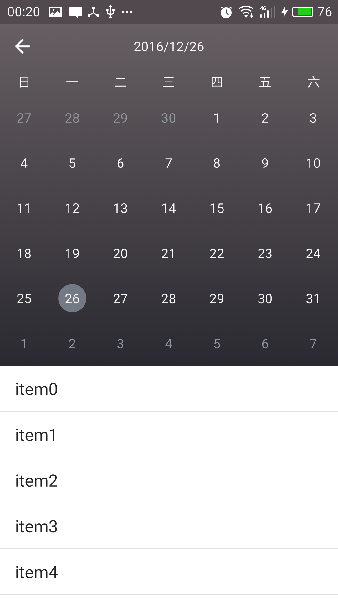

**关注我**

githup:[https://github.com/codbking](https://github.com/codbking)

csdn: [http://my.csdn.net/codbking](http://my.csdn.net/codbking)

****
# CalendarExaple
这是一个高仿钉钉和小米的日历控件，支持快速滑动，界面缓存。想要定制化UI，使用起来非常简单，就像使用ListView一样

**[apk下载](https://raw.githubusercontent.com/codbking/CalendarExaple/master/calendar_demo.apk)**

*  **先上两张demo的效果图，分别是仿小米和钉钉日历效果图**

*  **再看下交互效果**

