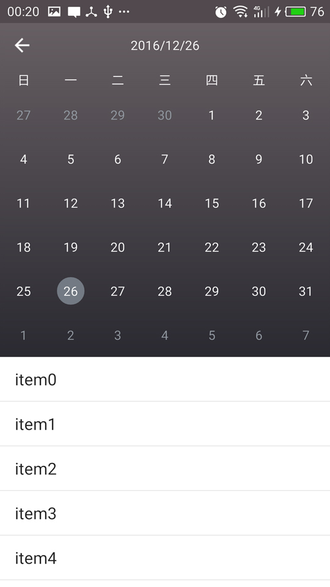
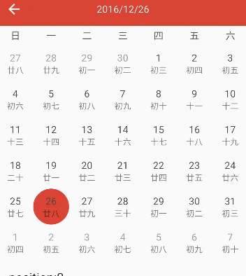

**关注我**

githup:[https://github.com/codbking](https://github.com/codbking)

csdn: [http://my.csdn.net/codbking](http://my.csdn.net/codbking)

****
# CalendarExaple

# 简介
这是一个高仿钉钉和小米的日历控件，支持快速滑动，界面缓存。想要定制化UI，使用起来非常简单，就像使用ListView一样

**一些特点：**

1. 可以自定义日历控件UI
2. 支持快速滑动
3. 支持农历和阳历
4. 界面UI缓存和日历数据缓存
5. 扩展view支持listView的滑动

**效果**

**[apk下载](https://raw.githubusercontent.com/codbking/CalendarExaple/master/calendar_demo.apk)**

*  **先上两张demo的效果图，分别是仿小米和钉钉日历效果图**




*  **再看下交互效果**




### how to use

 - **Add it in your root build.gradle at the end of repositories:**

```
	    allprojects {
		   repositories {
			...
			maven { url 'https://jitpack.io' }
		}
	    }
```

 -  **Add the dependency**
```sh
	dependencies {
	        compile 'com.github.codbking:CalendarExaple:v1.0.0'
	}
```

- **在layout的xml中添加CalendarLayout和CalendarDateView**

  注意：CalendarDateView一定是CalendarLayout第一个view，扩展view必须是CalendarDateView第二个view
```xml
   <com.codbking.calendar.CalendarLayout
        android:layout_width="match_parent"
        android:layout_height="0dp"
        android:layout_weight="1"
        >

        <com.codbking.calendar.CalendarDateView
            android:id="@+id/calendarDateView"
            android:layout_width="match_parent"
            android:layout_height="wrap_content"/>

        <ListView
            android:id="@+id/list"
            android:layout_width="match_parent"
            android:layout_height="wrap_content"
            android:background="#ffffff"
            />

    </com.codbking.calendar.CalendarLayout>
```

- 在你的java文件中设置CalendarDateView的CaledarAdapter和CalendarView.OnItemClickListener监听

   注意：想要设置选中效果，只需设置CaledarAdapter中的view的选中背景
```java
       mCalendarDateView.setAdapter(new CaledarAdapter() {
            @Override
            public View getView(View convertView, ViewGroup parentView, CalendarBean bean) {
                //判断convertView为null，可以有效利用view的回收重用，左右滑动的效率高
                if (convertView == null) {
                    convertView = LayoutInflater.from(parentView.getContext()).inflate(R.layout.item_xiaomi, null);
                }

                TextView chinaText = (TextView) convertView.findViewById(R.id.chinaText);
                TextView text = (TextView) convertView.findViewById(R.id.text);

                text.setText("" + bean.day);
                //mothFlag 0是当月，-1是月前，1是月后
                if (bean.mothFlag != 0) {
                    text.setTextColor(0xff9299a1);
                } else {
                    text.setTextColor(0xff444444);
                }
                chinaText.setText(bean.chinaDay);

                return convertView;
            }
        });

        mCalendarDateView.setOnItemClickListener(new CalendarView.OnItemClickListener() {
            @Override
            public void onItemClick(View view, int postion, CalendarBean bean) {
                mTitle.setText(bean.year + "/" + bean.moth + "/" + bean.day);
            }
        });
```

### 联系我

**email:codbking@gmail.com**


